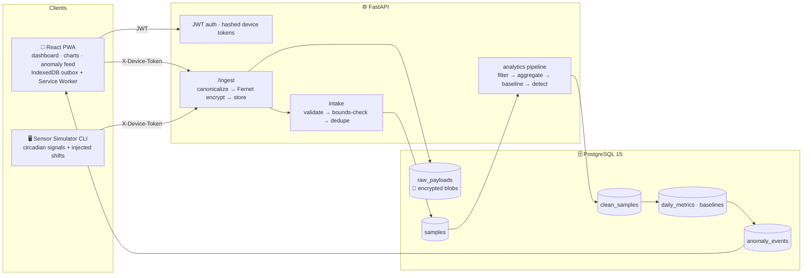
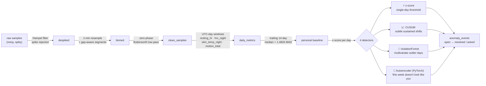
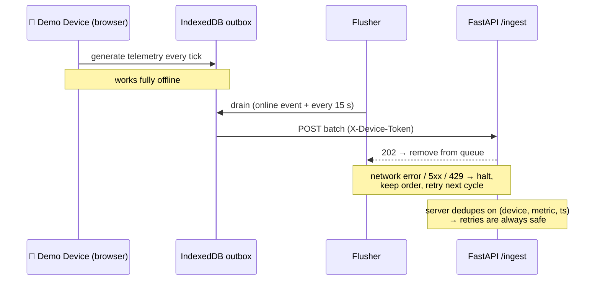

<div align="center">

# 🫀 Baseline — Sensor-to-App Signal Processing

**A personal biometric monitoring platform that learns *your* normal — and tells you when your body drifts away from it. No journaling. No manual logging. Ever.**

[](https://jenil133.github.io/Sensor-to-App-Signal-Processing-/)


</div>

---

> 🔗 **[Open the live demo →](https://jenil133.github.io/Sensor-to-App-Signal-Processing-/)**
> Auto-logged-in, zero setup. You're looking at 30 days of simulated wearable data with an illness-like physiological shift injected at day 25 — watch the charts break out of their baseline bands and the detectors light up. *(Static showcase build — the real stack below runs the full encrypted ingest + ML pipeline.)*

---

## 💡 What is this?

A wearable device streams **noisy, continuous telemetry** — heart rate, heart-rate variability (HRV), skin temperature, motion — to a Python backend that:

1. 🔐 stores every raw payload **encrypted at rest** (Fernet)
2. 🧹 cleans the signals with **digital filtering** (Hampel spike rejection + zero-phase Butterworth)
3. 📊 derives **personal daily baselines** (rolling median / MAD — *your* normal, not a population average)
4. 🤖 detects subtle physiological shifts with **four ML detectors** — early illness, overtraining, stress
5. 📱 visualizes everything in a **React PWA** that keeps generating & queueing data offline and syncs itself when connectivity returns

The "wearable" is fully simulated (CLI + in-browser demo device), so the entire system runs and proves itself **without any hardware**.

## 🏗️ Architecture



## 🔬 The signal pipeline



**Why four detectors?** Each catches what the others miss: z-score nails big single-day deviations, CUSUM accumulates small *persistent* drifts that never individually cross a threshold (the classic early-illness signature), IsolationForest spots weird *combinations* across metrics, and the per-user autoencoder learns your weekly rhythm and scores how unfamiliar the latest 7 days look.

## 📴 Offline-first sync (the PWA tier)



Kill your connection and the outbox just grows; restore it and everything drains hands-free within 15 seconds. Chromium browsers additionally get Workbox Background Sync replay for requests that failed mid-flight.

## 📁 Project structure

```
.
├── docker-compose.yml            # postgres + api + web (full stack)
├── server/
│   ├── Dockerfile
│   ├── requirements.txt
│   ├── alembic/                  # migrations 0001 → 0003
│   ├── app/
│   │   ├── main.py               # app wiring, security headers, error handlers
│   │   ├── config.py             # pydantic-settings (env-driven)
│   │   ├── models.py             # 9 tables, SQLite-compatible for tests
│   │   ├── security.py           # bcrypt · JWT · hashed device tokens
│   │   ├── crypto.py             # Fernet at-rest encryption tier
│   │   ├── limits.py             # slowapi rate limiting
│   │   ├── routers/              # auth · devices · ingest · metrics
│   │   │                         #   · anomalies · pipeline · models
│   │   ├── processing/           # intake · filters · aggregate
│   │   │                         #   · baselines · jobs (orchestrator)
│   │   └── anomaly/              # cusum · isoforest · autoencoder · engine
│   ├── simulator/                # realistic circadian signal generator + CLI
│   └── tests/                    # 33 tests, in-memory SQLite, no infra needed
└── web/
    ├── Dockerfile                # node build → nginx
    ├── nginx.conf
    └── src/
        ├── api/                  # typed client (+ static demo mode)
        ├── auth/                 # JWT context
        ├── components/           # MetricChart · AnomalyFeed
        ├── pages/                # Dashboard · Devices · DeviceSim · Login
        ├── sync/                 # IndexedDB outbox · flusher · generator
        └── sw.ts                 # service worker (Workbox background sync)
```

## 🚀 Quick start (development)

```bash
# 1. infra + backend
docker compose up -d postgres
python3.11 -m venv .venv && source .venv/bin/activate
pip install -r server/requirements.txt
cp server/.env.example server/.env
#    → set PAYLOAD_ENC_KEY:  python -c "from cryptography.fernet import Fernet; print(Fernet.generate_key().decode())"
cd server && alembic upgrade head
uvicorn app.main:app --reload            # api on :8000, docs on /docs

# 2. frontend (new terminal)
cd web && npm install && npm run dev     # dashboard on :5173

# 3. feed it data — register in the UI, create a device, copy the bld_ token
#    (new terminal, venv active, from the server/ directory):
cd server && python -m simulator.run --api http://localhost:8000 --device-token <bld_...> \
  --days 30 --seed 42 --start 2026-07-01 --inject-shift-day 25
```

Day 25 injects a realistic "coming down with something" signature (+6 bpm resting HR, +0.6 °C skin temp, −12 ms HRV). Within a pipeline run the CUSUM detectors fire **on the exact onset day**.

### 🐳 One-command full-stack deploy

```bash
cp server/.env.example server/.env       # set PAYLOAD_ENC_KEY + a strong JWT_SECRET
docker compose up --build -d
docker compose run --rm api alembic upgrade head
# → web on http://localhost:8080, api on :8000
```

## 🔌 API surface

| Endpoint | Auth | Purpose |
|---|---|---|
| `POST /api/v1/auth/register` · `/login` | — | account + JWT (rate-limited 10/min) |
| `GET /api/v1/me` | JWT | current user |
| `POST /api/v1/devices` | JWT | mint device + one-time `bld_` token (SHA-256 stored) |
| `POST /api/v1/ingest` | device token | encrypted batch ingest, idempotent (120/min) |
| `GET /api/v1/metrics` | JWT | raw series |
| `GET /api/v1/daily` | JWT | daily metrics + baseline bands + z-scores |
| `GET /api/v1/anomalies` · `POST …/{id}/ack` | JWT | event feed + acknowledge |
| `POST /api/v1/pipeline/run` | JWT | trigger analytics (also auto-runs after ingest) |
| `POST /api/v1/models/train` | JWT | train the per-user autoencoder (flag-gated) |
| `GET /api/v1/health` | — | liveness + DB check |

## 🔐 Security posture

- **Encryption at rest** — every raw payload Fernet-encrypted; app refuses to boot without a valid key
- **No recoverable device tokens** — only SHA-256 hashes stored; shown to the client exactly once
- **bcrypt (rounds 12)** passwords, uniform 401s (no user enumeration), byte-safe 72-byte handling
- **Rate limits** + `Retry-After`, four security headers on *every* response, generic 500s (tracebacks stay server-side)
- **Out-of-range readings dropped, never clamped** — a clamped fake value would poison baselines downstream

## ⚙️ Configuration

| Env var | Default | Purpose |
|---|---|---|
| `DATABASE_URL` | local postgres | SQLAlchemy URL (SQLite supported) |
| `JWT_SECRET` / `JWT_EXPIRES_MIN` | dev / 60 | token signing + lifetime |
| `PAYLOAD_ENC_KEY` | **required** | Fernet key for the encrypted tier |
| `CORS_ORIGINS` | `http://localhost:5173` | allowed origins |
| `ENABLE_AUTOENCODER` | `false` | detector #4 (needs `torch`, lazy-imported) |
| `MODELS_DIR` | `./models_store` | autoencoder checkpoints |
| `LOG_LEVEL` | `INFO` | logging |
| `RATE_LIMITS_ENABLED` | `true` | disable only for local bulk backfills |

## 🧪 Testing

```bash
cd server && pytest -q        # 33 tests: auth, ingest, filters, detectors,
                              # analytics API, e2e product slice — all on
                              # in-memory SQLite, zero infrastructure needed
```

## 🗺️ Future work

Real BLE wearable integration · push notifications · `MultiFernet` key rotation · distributed pipeline locking (DB advisory locks) · React Native build

---

<div align="center">

**[▶ Live demo](https://jenil133.github.io/Sensor-to-App-Signal-Processing-/)** · built with FastAPI, SciPy, scikit-learn, PyTorch & React

</div>
